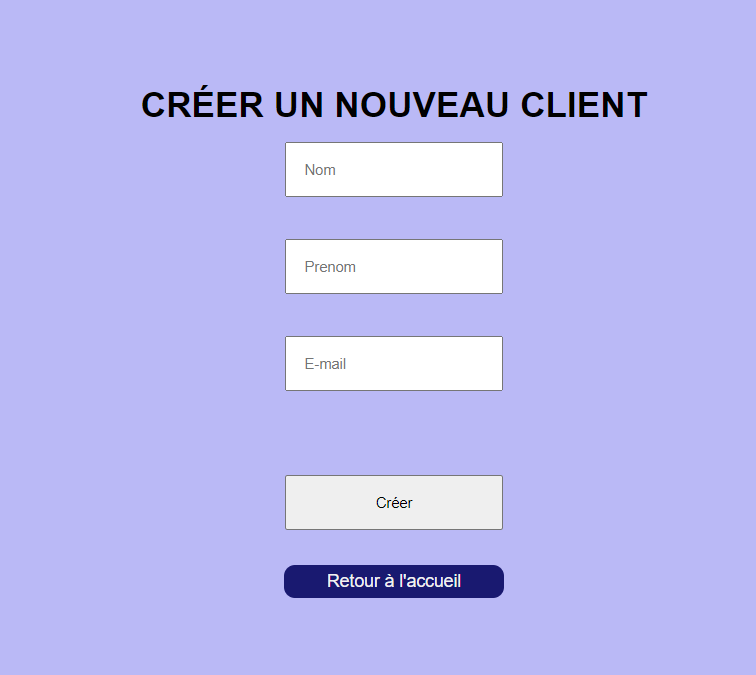

# PHP
Utiliser le C (create) R (read) U (update) D (delete) en PHP

## Vu1 : 

http://localhost/phpmyadmin/index.php?route=/sql&db=magasins&table=clients&pos=0

## Vu2 : 

"http://localhost/tuto-php/index.php"

## Vu3 : 

"http://localhost/tuto-php/create.php"

