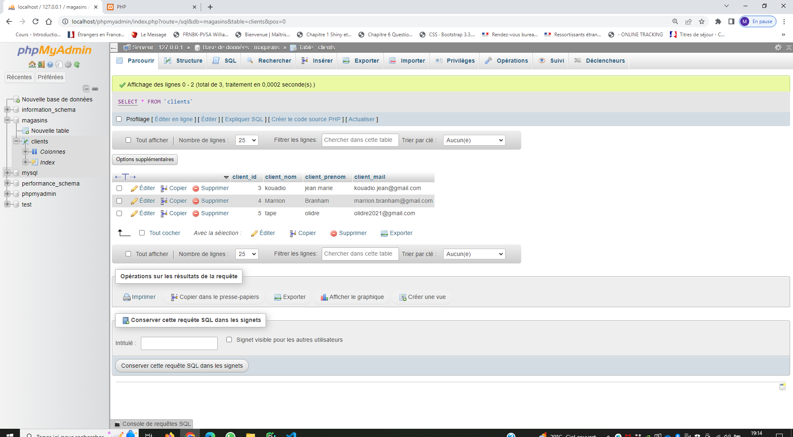
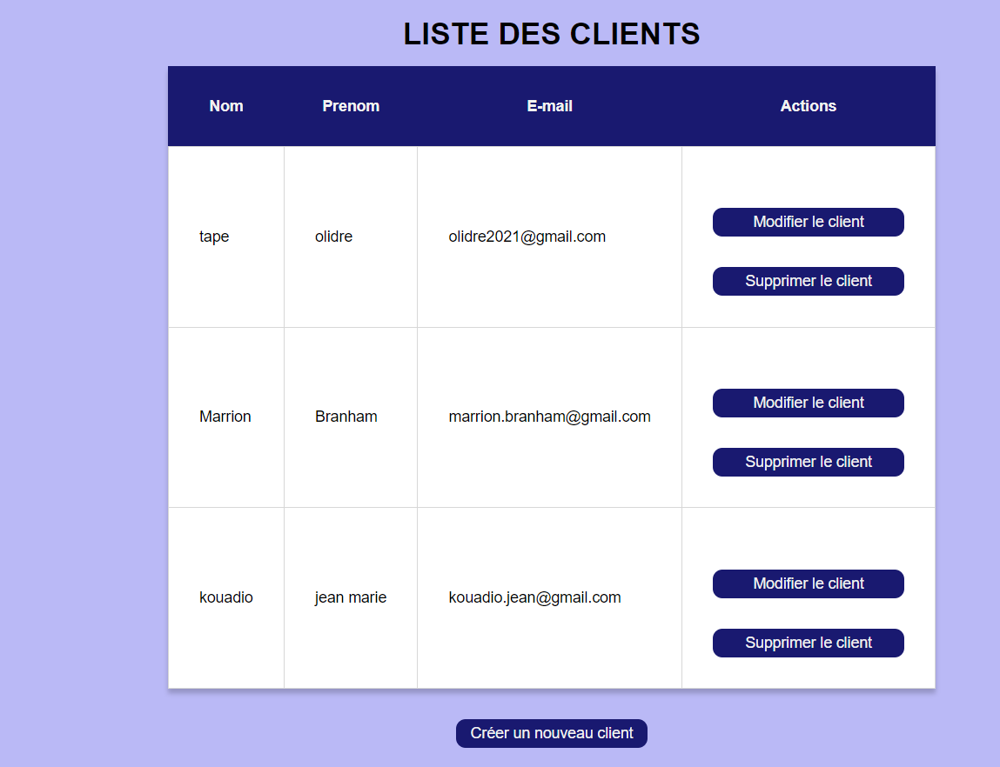

# PHP
Utiliser le C (create) R (read) U (update) D (delete) en PHP

## Graph1 : "http://localhost/phpmyadmin/index.php?route=/sql&db=magasins&table=clients&pos=0"

## Graph2 : "http://localhost/tuto-php/index.php"

